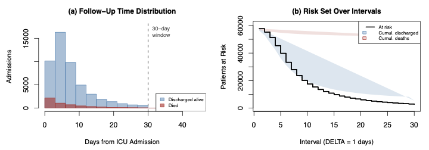
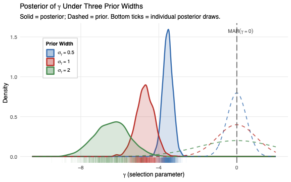

# bayes-mimic-survival

Bayesian (final project) on discrete-time survival analysis of ICU mortality using the full MIMIC-III database. The project combines tex manuscripts, R data-processing and analysis scripts, Stan models, and generated figures/tables for the main paper and supplement material that didn't fit within the main paper. 

<table>
  <tr>
    <td width="50%"></td>
    <td width="50%"></td>
  </tr>
</table>

## Repository structure

- `project/` - the main paper source, including `final-project.tex`, bibliography files, the shared LaTeX style file, and tables.
- `supplement/` - the supplement source, including `supplement.tex` and its local LaTeX support files.
- `proposal/` - earlier proposal material and its supporting LaTeX files.
- `data/` - the MIMIC-III demo CSV files, download helpers, and column-reference scripts.
- `stan/` - Stan programs plus saved fit objects for the main model variants.
- `plots/` - exported figures used in the paper and supplement.
- `output/` - generated tables, LaTeX table inputs, checkpoints, and other analysis artifacts.
- `scripts/` - utility scripts for downloading and analyzing large csv files.
- Top-level R scripts - `mimic_prep.r` (prep cohort data), `mimic_load.R` (easily access processed data), `mimic_analysis.R` (running stan models in CmdStanR), `mimic_plots.R` (plot figures), and `mimic_summary.R` (summarize the processed cohort data) for the main data and analysis workflow.

## Project focus

The analysis uses a person-period discrete-time survival setup for ICU mortality under informative censoring settings. The main paper covers:

- a standard model with independent censoring,
- a frailty extension for unobserved heterogeneity,
- an MNAR sensitivity analysis for informative censoring.

## How to navigate

If you are new to the repo, start with `project/final-project.tex` to understand the model and results. Then move to the R scripts for data prep and analysis, the `stan/` folder for the model code, and `output/` plus `plots/` for the generated tables and figures. The supplement is the best place for derivations and extra technical detail.
